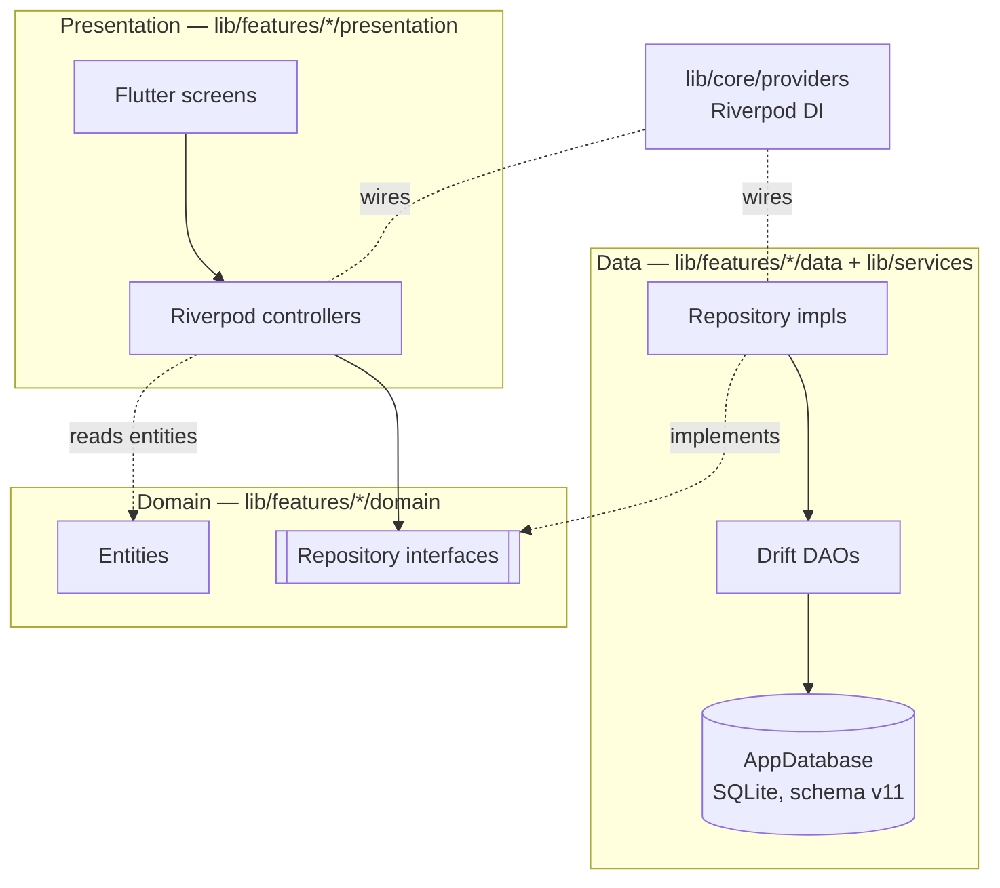
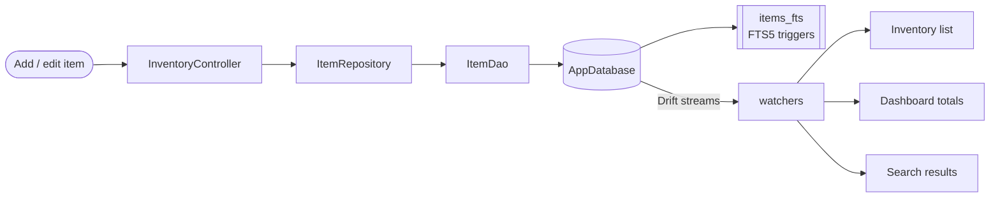
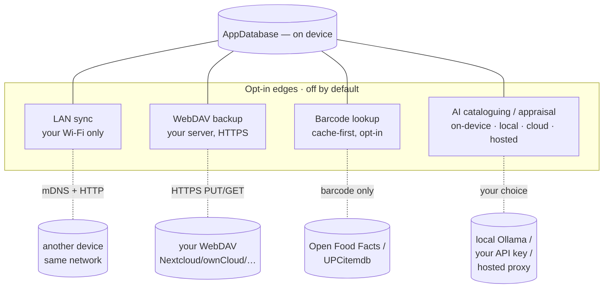
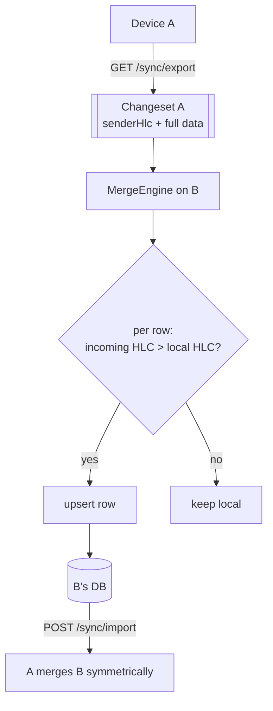
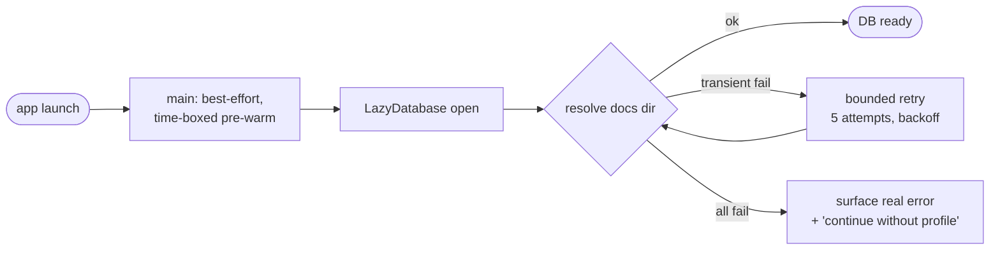

# Architecture Overview

> The one-page mental model of Still Life, then the diagrams that make it concrete.
> For *why* each load-bearing decision was made, see [`docs/adr/`](../adr/). For the
> precise data model, see [`docs/reference/data-model.md`](../reference/data-model.md).

## What this is, in one paragraph

Still Life is a **local-first home-inventory app**. Everything lives in an on-device
SQLite database (via Drift); the app is fully usable with no account and no network.
Code is organised in **Clean Architecture** layers — `domain` (entities + repository
interfaces), `data` (Drift DAOs + repository implementations), `presentation`
(Riverpod controllers + Flutter screens) — sliced by feature under `lib/features/`,
with cross-cutting services under `lib/services/`. A handful of **opt-in, off-by-
default edges** — LAN sync, WebDAV backup, tiered AI cataloguing — are the only things
that can move data off the device, and each is gated behind an explicit setting.

## The layers (the single most important picture)

Two facts to hold onto:

1. **The domain layer knows nothing about Drift or Flutter.** Presentation depends on
   domain interfaces; data implements them; dependency injection (`lib/core/providers/`)
   wires the concrete pieces at the edges. See
   [ADR-0001](../adr/0001-flutter-clean-architecture.md).
2. **The database is the source of truth, and it's local.** No feature assumes a
   server. Everything else — sync, backup, AI — is a layer *on top of* a complete
   offline app. See [ADR-0002](../adr/0002-local-first-no-account.md).

## The data flow (add an item → see it everywhere)

- Writes go **down** through controller → repository → DAO → database; reactive reads
  come **up** through Drift's stream queries, so the inventory list, dashboard, and
  search all update live off one write.
- Full-text search is an FTS5 virtual table (`items_fts`) kept in sync by SQL triggers
  declared in the migration (`database.dart`).

## Where data can leave the device (the edges)

Still Life is offline by default. These are the *only* egress paths, each opt-in and
off until you enable it. See [privacy model](../privacy-model.md) for the full table.

- **LAN sync never touches the internet.** Peers are found by mDNS
  (`_stilllife._tcp`, port 8420) and addressed by LAN IP; there is no cloud relay.
- **AI is a four-tier cascade** (`provider_manager.dart`): on-device → local Ollama →
  cloud API (your own key) → hosted proxy. Default order is on-device first. The
  on-device tier is currently a **stub** (see [limitations](../limitations.md)).

## The sync merge (the formally-specified core)

`verify`-grade rigor lives in one place: the merge that reconciles two devices. It is
**state-based, per-row, last-writer-wins by Hybrid Logical Clock (HLC)**, with
soft-delete tombstones.

- Every syncable row carries `nodeId` + `hlc` + `isDeleted`. A merge applies an
  incoming row only when it is **strictly newer** by HLC, so a stale peer can neither
  clobber a newer local edit nor resurrect a newer tombstone.
- The whole merge runs inside one DB transaction, behind a path-sandbox guard so a
  crafted payload can't point a file path at the database file and delete it. See the
  [yellow paper](../spec/yellow-paper.md) and
  [ADR-0006](../adr/0006-import-db-safety.md).

## Boot resilience (never brick the family's data)

Drift's `LazyDatabase` caches the *first* open error for the whole session — so one
transient platform-channel hiccup would permanently break every write, onboarding
included. A bounded retry (`resolveAppDocumentsDir`) lets the channel come up instead
of bricking the database, and onboarding surfaces the real error with an escape hatch
rather than trapping the user. See [ADR-0005](../adr/0005-boot-resilience.md).

## Module map (where to look)

| Concern | Location |
|---|---|
| **Data model / schema / migrations** | `lib/services/database/tables.dart`, `database.dart`, `daos/` (13 DAOs) |
| **Inventory & locations** | `lib/features/inventory/`, `lib/features/locations/` |
| **Financial (value, depreciation, policies, reports)** | `lib/features/dashboard/`, `lib/features/insurance/`, `lib/features/reports/` |
| **Sync** | `lib/services/sync/` (`crdt_manager`, `merge_engine`, `changeset`, `lan_sync_{server,client}`), `lib/services/network/lan_discovery.dart` |
| **Export / import / backup** | `lib/services/export/` (`json_export_service`, `csv_export_service`, `import_service`), `lib/services/backup/`, `lib/features/reports/data/services/pdf_report_generator.dart` |
| **AI cataloguing / appraisal / chat** | `lib/services/ml/` (`provider_manager` + `*_provider`s), `lib/services/appraisal/`, `lib/services/chat/`, `lib/features/video_analysis/`; paid-tier backend `server/hosted-llm/` |
| **Scanning / product lookup / OCR** | `lib/features/scanning/`, `lib/services/product_lookup/`, `lib/services/import/` |
| **Boot / onboarding** | `lib/main.dart`, `lib/app/boot.dart`, `lib/services/database/database.dart`, `lib/features/onboarding/` |
| **QR labels** | `lib/features/labels/`, `lib/core/utils/label_id.dart` |
| **DI / config** | `lib/core/providers/`, `lib/core/config/feature_flags.dart` |
| **Design system** | `../OpenHearth/ohStyle/openhearth_design` (path dependency) |

## Invariants that must always hold

These are the rules the whole design depends on. Breaking one is a design regression,
not a feature. (See [VISION.md](../VISION.md) and the [ADRs](../adr/).)

1. **No account, no mandatory cloud.** Core features work fully offline.
2. **Every egress is opt-in, named, and off by default.** No silent network calls.
3. **No telemetry / analytics / crash SDKs.** Enforced by their absence.
4. **User data is never bricked or silently wiped.** Boot retries; imports are
   sandboxed and transactional; sync merges fail safe (LWW, never blind clobber).
5. **The domain layer stays framework-free.** Drift and Flutter live at the edges.
